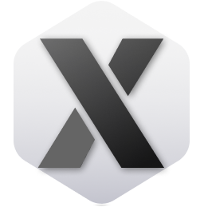
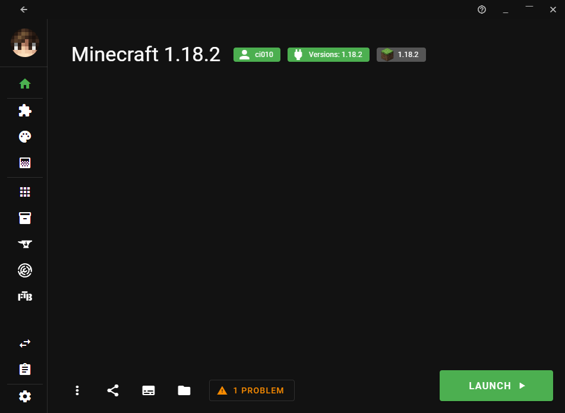

  

  
  
  
   
  
  

Visit the [official site](https://xmcl.app) to download the app!

[中文 README](README.zh.md)

## Features

- 📥 **Download & auto complete**. Support download `Minecraft`, `forge`, `fabric`, `quilt`, `optifine`, `jvm` from official or third party mirror.
- ⚡️ **Download Fast**. Reuse socket via http/https agents, and download the files by in parts concurrently.
- 💻 **Cross platforms**. The launcher bases on electron, support 🗔 Windows 10, 🍎 Mac, and 🐧 Linux.
- 📚 **Multi-Instancing**. Users can create multiple instances to isolate the different versions & mods & launch setting.
- 🗂 **Manage all resources**. Use (hard/symbolic) link to install resources in instances, keep your disk size optimal. No copy of mods everywhere! 😆
- 🔥 **Built-in support of Curseforge, Modrinth**. You can download resources inside the launcher.
- 📦 Support import/export Curseforge & Modrinth modpack with compliance!
- 🔒 **Support multiple account systems**. Built-in Microsoft login and Mojang Yggdrasil API. It also has builtin support of [ely.by](https://ely.by/) and [littleskin.cn](littleskin.cn). You can also add third-party authentication server!
- 🔗 **Peer to peer connection between users**. You can play multiplayer over "LAN" even you are not in same physical LAN!
- 🔑 **Code sign & modern packaging**. Under Windows, you can use `appx` and `appinstaller` to install the app. You won't receive blocking message from you browser and see smart screen anymore! 😎

## Contribute

See [Contribute](./CONTRIBUTING.md)

## LICENSE

[MIT](LICENSE)

## Sponsor (aifadian)

<!-- afdian-start -->

<!-- afdian-end -->

## Credit

[vanja-san](https://github.com/vanja-san), who provides Russian locale!
[lukechu10](https://github.com/lukechu10) & [HoldYourWaffle](https://github.com/HoldYourWaffle) helps me on Launcher core
[laolarou726](https://github.com/laolarou726), who helps a lot on launcher design.

Also special thanks to

[Yricky](https://github.com/Yricky), [Jin](https://github.com/Indexyz), [LG](https://github.com/LasmGratel), [Phoebe](https://github.com/PhoebezZ), [Sumeng Wang](https://github.com/darkkingwsm), [Luca](https://github.com/LucaIsGenius), [Charles Tang](https://github.com/CharlesQT)
