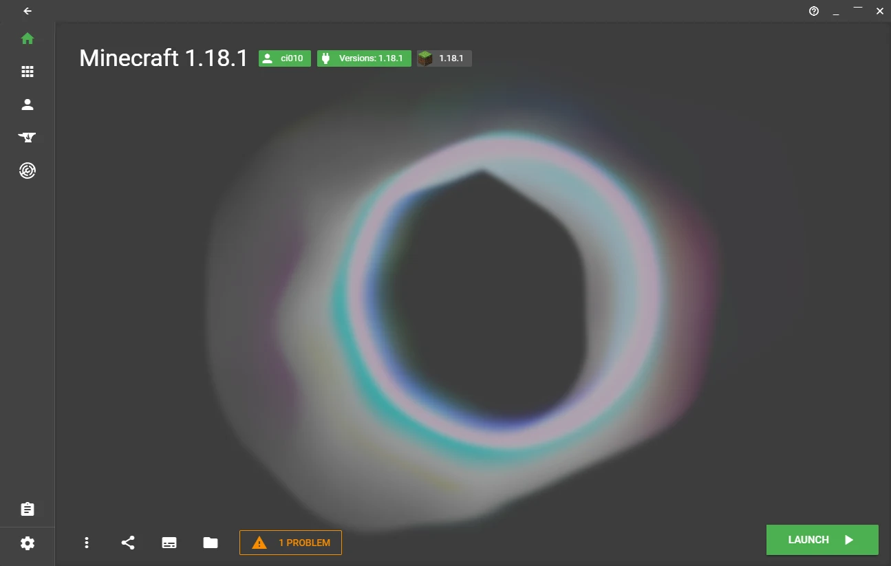

# x minecraft launcher

Visit the [official site](https://xmcl.app) to download the app!

[中文 README](README.zh.md)

## Features

- 📥 Download & auto complete. Support download game, forge, fabric, jvm from official or third party mirror.
- ⚡️ Download Fast. Reuse socket via http/https agents, and download the files by in parts concurrently.
- 💻 Cross platforms. The launcher bases on electron, support 🗔 Windows 10, 🍎 Mac, and 🐧 Linux.
- 📚 Multi-Instancing. Users can create multiple instances to isolate the different versions & mods & launch setting.
- 🗂 Manage all resources. Use (hard/symbolic) link to install resources in instances, keep your disk size optimal. No copy of mods everywhere! 😆
- 🔥 Built-in support of curseforge, Modrinth. You can download resources inside the launcher.
- 📦 Support import/export curseforge modpack.
- 🔒 Support multiple account system. Built-in Microsoft login and Mojang Yggdrasil API. You can also add third-party authentication server, like blessing skin!
- 🔗 Peer to peer connection between users. You can play multiplayer over "LAN" even you are not in same physical LAN!
- 🔑 Code sign & modern packaging. Under Windows, you can use `appx` and `appinstaller` to install the app. You won't receive blocking message from you browser and see smart screen anymore! 😎

## Contribute

See [Contribute](./CONTRIBUTING.md)

## LICENSE

[MIT](LICENSE)

## Sponsor (aifadian)

| 捐赠者                                                                                                                                                                          | 时间                | 捐赠            |
| ------------------------------------------------------------------------------------------------------------------------------------------------------------------------------- | ------------------- | --------------- |
|    水合                                                                         | 2022-06-02 21:01:52 | 基础支持 ￥5.00  |
|    Jisoadng | 2022-05-22 16:25:23 | 基础支持 ￥5.00  |
|    圣剑                                  | 2022-05-21 22:34:02 | 加大支持 ￥30.00 |
|    同谋者                                                                       | 2022-05-19 10:51:51 | 加大支持 ￥30.00 |
|     DIO                                                                          | 2022-05-15 20:58:56 | 基础支持 ￥5.00  |
|    爱发电用户_DJpu                                                   | 2022-05-09 16:42:33 | 自选发电        |

## Credit

[vanja-san](https://github.com/vanja-san), who provides Russian locale!
[lukechu10](https://github.com/lukechu10) & [HoldYourWaffle](https://github.com/HoldYourWaffle) helps me on Launcher core
[laolarou726](https://github.com/laolarou726), who helps a lot on launcher design.

Also special thanks to

[Yricky](https://github.com/Yricky), [Jin](https://github.com/Indexyz), [LG](https://github.com/LasmGratel), [Phoebe](https://github.com/PhoebezZ), [Sumeng Wang](https://github.com/darkkingwsm), [Luca](https://github.com/LucaIsGenius), [Charles Tang](https://github.com/CharlesQT)
