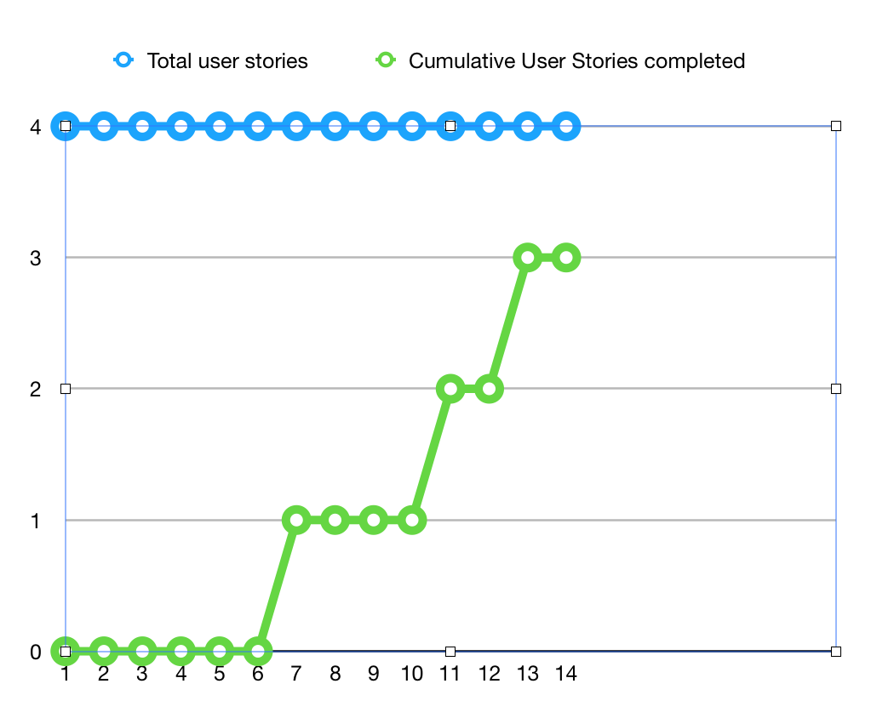

# Sprint 2 Report

Product name : ILauncher,

Team name: LWPJ.

Date: Nov. 5

## Action to Stop doing

We cut the task content related to the data storage for some teammates, and decouple the task related to the UI and data, so they won't block the progress of each other.

## Action to start doing

We should have more small sync meetings.

We should more focusing on the qualities of the UI.

## Action to keep doing

We should keep the one long meeting each week. It's a good chance for teammate to learn more about the project and technology.

## Work completed/not completed

Stories completed:

As a user, I want to ping the server info correctly.

As a user, I want to have the capability to manage the local mods.

As a user, I want to be able to config the game.

Story completed partially:

As a user, I want to have the capability to manage the local resource packs.

Basically, this story is almost complete, instead some advance setting part. It should fulfill all the basic demand of user.

## Work completion rate

There are 4 user stories in this Sprint. 

The total number of estimated ideal work hours completed is 30.

Last sprint have 14 days, so the user stories/day is 4/14, about 0.28 stories/day, and hours/day is about 2.14 hours/day.

Totally, last two sprints have 28 days. The user stories/day is 8/28, about 0.29 stories/day, and hours/day is 1.96.

