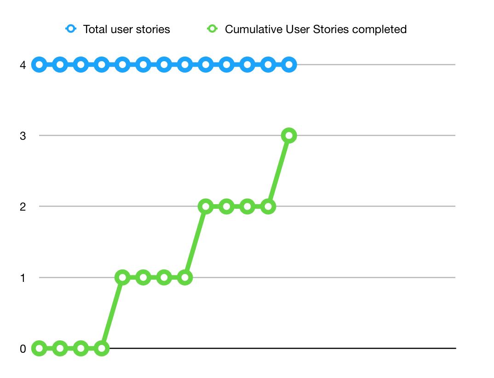

# Sprint 4 Report

Product name : ILauncher,

Team name: LWPJ.

Date: Dec. 3

## Action to Stop doing

Team members should stop working on the master branch to avoid merging conflict

## Action to start doing

Team members should start closing their issues on github after they finish their tasks

## Action to keep doing

Team members should keep implementing clean codes. It makes the debugging process much efficient.

## Work completed/not completed

The stories that have been completed:

As an international user, I want to access the app from my native language.

As a Chinese user, I want to access the mcmod.cn wiki

The Story was not completed:

As a user, I want to identify the any local mods by categories, which is much easier than reading description and name.

## Work completion rate

There are 4 user stories in this Sprint. 

The total number of estimated ideal work hours completed is 30.

Last sprint has 14 days, so the user stories/day is 4/14, about 0.28 stories/day, and hours/day is about 2.14 hours/day.

Totally, last two sprints have 42 days. The user stories/day is 12/42, about 0.29 stories/day, and hours/day is 2.02.

