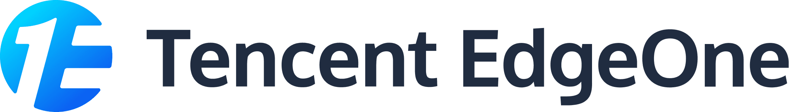

<p align="center">
  <a href="https://xmcl.app" target="_blank">
    
  </a>
</p>

<p align="center">
  <a href="https://github.com/Voxelum/x-minecraft-launcher">
    
  </a>
  <a href="https://github.com/Voxelum/x-minecraft-launcher/blob/master/LICENSE">
    
  </a>
  <a href="https://conventionalcommits.org">
    
  </a>
  <br>
  <a href="https://discord.gg/W5XVwYY7GQ">
    
  </a>
  <a href="https://kook.top/gqjSHh">
    
  </a>
  <a href="https://afdian.com/@ci010">
    
  </a>
  <a href="https://patreon.com/xmcl">
    
  </a>
</p>


공식 사이트([https://xmcl.app](https://xmcl.app/ko))에서 앱을 다운로드할 수 있어요.

만약 `winget`을 사용 중이면, 아래 명령어로 설치할 수 있어요:

```bash
winget install CI010.XMinecraftLauncher
```

macOS에서는 Homebrew tap을 통해 설치할 수 있어요:

```bash
brew tap voxelum/xmcl
brew install --cask --no-quarantine voxelum/xmcl
```

<kbd>[](../docs/README.uk.md)</kbd>
<kbd>[](../docs/README.ru.md)</kbd>
<kbd>[](../docs/README.de.md)</kbd>
<kbd>[](../docs/README.zh.md)</kbd>
<kbd>[](../docs/README.jp.md)</kbd>
<kbd>[](../docs/README.pl.md)</kbd>
<kbd>[](../docs/README.kz.md)</kbd>
<kbd>[](../docs/README.es.md)</kbd>
<kbd>[](../docs/README.ko.md)</kbd>


## 기능


- 📥 다운로드 및 자동 완성: `Minecraft`, `Forge`, `Fabric`, `Quilt`, `OptiFine`, `JVM` 등을 공식 또는 서드파티 미러에서 다운로드할 수 있어요.
- ⚡️ 빠른 다운로드: HTTP/HTTPS 에이전트로 소켓을 재사용하고 파일을 여러 파트로 병렬 다운로드해서 속도를 높여요.
- 💻 크로스 플랫폼: 런처는 Electron 기반이고, Windows 10/11, macOS, Linux에서 동작해요.
- 📚 멀티 인스턴스: 여러 인스턴스를 만들어 버전, 모드, 실행 설정을 분리해서 관리할 수 있어요.
- 🗂 리소스 전체 관리: 하드/심볼릭 링크를 이용해 인스턴스에 리소스를 설치해 디스크 사용을 최적화해요. 모드가 여기저기 복사될 일이 없어요.
- 🔥 CurseForge와 Modrinth 내장 지원: 런처 안에서 바로 리소스를 다운로드할 수 있어요.
- 📦 모드팩 가져오기/내보내기 지원: CurseForge 및 Modrinth 포맷을 준수해서 처리돼요.
- 🔒 다양한 계정 시스템 지원: Microsoft 로그인과 Mojang Yggdrasil API가 기본으로 있어요. 또한 [ely.by](https://ely.by/)와 [littleskin.cn](https://littleskin.cn)도 기본 지원돼요. 서드파티 인증 서버도 추가할 수 있어요.
- 🔗 피어 투 피어 연결: 물리적으로 같은 LAN이 아니어도 LAN 멀티플레이처럼 플레이할 수 있어요.
- 🔑 코드 서명 및 최신 패키징: Windows에서는 `appx`와 `appinstaller`로 설치할 수 있어요. 브라우저의 차단 메시지나 SmartScreen 오류를 더 이상 보지 않아도 돼요. 😎

## 기여하기

[](https://deepwiki.com/Voxelum/x-minecraft-launcher)

일반 개발 관련해서는 [기여하기](../contributing/CONTRIBUTING.ko.md)를 참고해 주세요.

번역(i18n) 작업을 하려면 [현지화를 시작하기](https://xmcl.app/ko/guide/i18n)를 따라 진행해 주세요.

## 라이선스

[MIT](LICENSE)

## 스폰서

| [](https://signpath.io/) | Windows용 무료 코드 서명(제공: [SignPath.io](https://signpath.io/), 인증서: [SignPath Foundation](https://signpath.org/)) |
| :----------------------------------------------------------------------------------------------------------------------------: | :--------------------------------------------------------------------------------------: |
| [](https://deno.com/deploy) | [Deno Deploy](https://deno.com/deploy), XMCL은 서버리스 자바스크립트 앱에 Deno Deploy를 활용하고 있어요. 제공: [Deno](https://deno.com/) |
| [](https://edgeone.ai/) | [Tencent EdgeOne](https://edgeone.ai/)이 아시아 CDN, 엣지, 보안 솔루션을 제공해요. CDN 가속 및 보안은 Tencent EdgeOne의 후원을 받고 있어요. |

### 스폰서 (AFDIAN)

<!-- afdian-start -->
<div style="display: flex; align-items: center; justify-items:center; gap: 0.2em; flex-wrap: wrap;">
<a title="爱发电用户_9d663: ￥390.00" href="https://afdian.com/u/9d663ec6fb6711ec9ace52540025c377">  </a>
<a title="爱发电用户_19e29: ￥300.00" href="https://afdian.com/u/19e292c21a1d11ee929a52540025c377">  </a>
<a title="ahdg: ￥180.00" href="https://afdian.com/u/dd9058ce20df11eba5c052540025c377">  </a>
<a title="Kandk: ￥30.00" href="https://afdian.com/u/404b86a078e111ecab3652540025c377">  </a>
<a title="白雨 楠: ￥30.00" href="https://afdian.com/u/7f6ad7161b3e11eb8d0e52540025c377">  </a>
<a title="圣剑: ￥30.00" href="https://afdian.com/u/ef50bc78b3d911ecb85352540025c377">  </a>
<a title="同谋者: ￥30.00" href="https://afdian.com/u/7c3c65dc004a11eb9a6052540025c377">  </a>
<a title="染川瞳: ￥5.00" href="https://afdian.com/u/89b1218c86e011eaa4d152540025c377">  </a>
<a title="爱发电用户_CvQb: ￥5.00" href="https://afdian.com/u/177bea3cf47211ec990352540025c377">  </a>
<a title="水合: ￥5.00" href="https://afdian.com/u/039508f2b17d11ebad1052540025c377">  </a>
<a title="爱发电用户_0c5c8: ￥5.00" href="https://afdian.com/u/0c5c865e08ee11ecba1352540025c377">  </a>
<a title="DIO: ￥5.00" href="https://afdian.com/u/7ac297b4722211eab4a752540025c377">  </a>
<a title="爱发电用户_DJpu: ￥5.00" href="https://afdian.com/u/8c23a236cf7311ec9c3452540025c377">  </a>
</div>
<!-- afdian-end -->

## 크레딧 및 감사 인사

### 🌍 커뮤니티 & 번역 기여

**[BANSAFAn](https://github.com/BANSAFAn)**
러시아/우크라이나 지역 커뮤니티 지원 및 운영 · 우크라이나어 번역

**[Marmur2020](https://github.com/Marmur2020)**
완전한 우크라이나어 번역

**[vanja-san](https://github.com/vanja-san)**
러시아어 지원

### 📦 패키지 유지

**[VolodiaKraplich](https://github.com/VolodiaKraplich)**
AUR (Arch User Repository) 패키지 관리를 해 주고 있어요.

**[0xc0000142](https://github.com/0xc0000142)**
winget 패키지 관리를 해 주고 있어요.

### 🛠️ 개발 기여

**[lukechu10](https://github.com/lukechu10) & [HoldYourWaffle](https://github.com/HoldYourWaffle)**
런처 핵심 개발을 해 주고 있어요.

**[laolarou726](https://github.com/laolarou726)**
런처 디자인과 UI/UX를 도와주셨어요.

### 💙 특별한 감사

다음 분들께 감사드려요:

[Yricky](https://github.com/Yricky) · [Jin](https://github.com/Indexyz) · [LG](https://github.com/LasmGratel) · [Phoebe](https://github.com/PhoebezZ) · [Sumeng Wang](https://github.com/darkkingwsm) · [Luca](https://github.com/LucaIsGenius) · [Charles Tang](https://github.com/CharlesQT)

---

