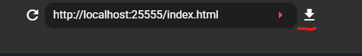

# Быстрый старт

## Настройка окружения

*Эта статья написана на основе опыта использования vscode, рекомендуется использовать vscode для разработки*

Перейдите в репозиторий github, https://github.com/Voxelum/x-minecraft-launcher-template, нажмите Use this template, чтобы создать репозиторий лаунчера


Локально клонируйте только что созданный репозиторий, например, если ваш репозиторий называется `my-launcher`

```bash
git clone https://github.com/<username>/my-launcher
```

Перейдите в папку репозитория и установите его, убедитесь, что у вас есть `nodejs` и `pnpm`.

<details>
  <summary>Как установить pnpm</summary>
  
  Подробнее смотрите https://www.pnpm.cn/installation
  
  Если у вас есть node, вы можете установить так
  ```sh
  npm install -g pnpm
  ```
</details>

```bash
cd my-launcher # перейти в папку
pnpm i # установить окружение разработки
```

После завершения установки запустите следующую команду, чтобы запустить окружение разработки

```bash
pnpm dev
```

Если установка прошла успешно, вы увидите в командной строке следующее

```
  vite v2.7.13 dev server running at:

  > Local: http://localhost:25555/
  > Network: use `--host` to expose
```

Затем откройте XMCL для загрузки вашего окружения разработки,
Найдите иконку XMCL в системном трее, щелкните правой кнопкой мыши и выберите `Просмотреть интерфейс стороннего лаунчера`


В верхней панели введите адрес из командной строки и добавьте в конце `index.html`

Например: `http://localhost:25555/index.html`, и нажмите кнопку установки



После установки вы увидите надпись `Шаблон лаунчера` в списке интерфейсов, нажмите `Запустить и установить по умолчанию`


Затем вы увидите интерфейс шаблона лаунчера

## Использование сервисов

Основные функции лаунчера инкапсулированы как `Service` (сервисы). Сервисы бывают двух типов: с состоянием и без состояния.

Большинство сервисов имеют состояние, например, состояние сервиса установки сохраняет список версий, полученных при обновлении (например, Minecraft),
сервис пользователя сохраняет состояние входа пользователя.

Доступ к состоянию сервиса можно получить через `service.state`.

### Распространенные методы сервисов

| Функция | Сервис | Связанный метод | Примечание |
|---------|--------|-----------------|------------|
| Запуск игры | LaunchService | launch | По умолчанию запускает текущий экземпляр |
| Обновить список версий Minecraft | InstallService | refreshMinecraft | После обновления нужно получить список версий через state (состояние) |
| Установить Minecraft | InstallService | installMinecraft | Нужно получить информацию о версии для установки через state как параметр |
| Установить Forge | InstallService | installForge | |
| Создать экземпляр | InstanceService | createInstance | |
| Выбрать экземпляр | InstanceService | mountInstance | |
| Редактировать экземпляр | InstanceService | editInstance | |
| Обновить список установленных локальных версий | VersionService | refreshVersions | Результаты обновления сохраняются в state |

### Распространенные свойства сервисов

| Функция | Сервис | Связанное свойство | Примечание |
|---------|--------|-------------------|------------|
| Получить список версий Minecraft | InstallService | state.minecraft | |
| Список версий Forge для установки | InstallService | state.forge | Этот список хранится по версии Minecraft, например state.forge['1.18.2'] - это список forge для 1.18.2 |
| Получить путь текущего выбранного экземпляра | InstanceService | state.path | Используйте вместе с state.all[path] для получения конфигурации экземпляра для этого пути |
| Все известные экземпляры | InstanceService | state.instances | |
| Получить список установленных модов экземпляра | InstanceModService | state.mods | |
| Получить список **всех** установленных модов | ResourceService | state.mods | |
| Получить список всех установленных локальных версий | VersionService | state.local | |

## Сценарии

Q: Я выполнил все шаги выше и теперь готов настроить собственный лаунчер для моего сервера. Сейчас мне нужны базовые функции, включая, но не ограничиваясь "обновлением версий minecraft и forge, синхронизацией модов и конфигурационных файлов с сервером, официальным или оффлайн входом". Как это реализовать в коде?

A:
Прежде чем ответить на этот вопрос, вам нужно понимать механизм экземпляров (instance) XMCL, это не сложно, детали смотрите в [этой документации](https://xmcl.app/zh/faq))

Чтобы избежать конфликтов между конфигурацией нашего сервера и другими конфигурациями запуска, нам нужно сначала получить уникальный экземпляр

```ts
// Получить директорию экземпляра запуска
instancePath.value = await instanceService.acquireInstanceById('piggy-server')
await instanceService.mountInstance(instancePath.value)
```

Где `piggy-server` - это уникальный ID конфигурации запуска, который вы выбираете, а `mountInstance` обеспечивает, что все последующие операции будут применяться к вашей конфигурации.

### Ваша конфигурация запуска

Если вашему серверу нужен Minecraft 1.18.2, Forge 40.0.44 и набор модов.
Поскольку наш шаблон использует vue, здесь приведем пример реализации vue, сначала вам нужно объявить их в коде

```ts
const expectMc = ref('1.18.2') // версия mc
const expectForge = ref('40.0.44') // версия forge
const modsLists = ref([
  {
    // путь к моду
    path: "mods/Architectury-4.1.39.09fa85.jar",
    // URL загрузки мода
    url: "https://raw.staticdn.net/dozono/PigServerMods/master/mods/Architectury-4.1.39.09fa85.jar",
    // sha1 мода
    hash: "09fa853c5eef54b3df2cfafe4d3f76a2101e5b2e"
  }
  //... много других модов пропущено
])
```

С этим вы можете использовать реактивное API vue для вычисления нужной конфигурации запуска

```ts
// Текущий экземпляр запуска
const targetInstance = computed(() => instanceService.state.all[instancePath.value])
// Ожидаемая версия запуска
const expectedVersion = computed(() => versionService.state.local.find(v => v.minecraftVersion === expectMc.value && resolveForgeVersion(v) === expectForge.value))
// Ожидаемая версия mc
const expectedMinecraftVersion = computed(() => versionService.state.local.find(v => v.minecraftVersion === expectMc.value && v.inheritances.length === 1))
// Моды для установки
const modsToInstalled = computed(() => {
  const installed = instanceModService.state.mods
  return modsLists.value.filter(m => !installed.find(v => v.hash === m.hash))
})
// Нужно ли обновлять экземпляр запуска
const needUpdate = computed(() => !expectedVersion || modsToInstalled.value.length > 0)
```

Затем вы можете установить Minecraft или Forge в зависимости от ситуации

```ts
// Если нет соответствующей версии mc
if (!expectedMinecraftVersion.value) {
  status.status = Status.DownloadMinecraft
  // Установить minecraft
  const mcVersion = installService.state.minecraft.versions.find(mc => mc.id === expectMc.value)
  await installService.installMinecraft(mcVersion!)
}

// Если нет соответствующей версии mc + forge
if (!expectedVersion.value) {
  status.status = Status.DownloadForge
  // Установить forge
  await installService.installForge({
      mcversion: expectMc.value,
      version: expectForge.value,
  })
}
```

Затем вам нужно убедиться, что моды и другие файлы в экземпляре обновлены

```ts
// Если есть моды для установки
if (modsToInstalled.value.length > 0) {
  status.status = Status.DownloadUpdate
  // Обновить файлы
  await instanceIOService.applyInstanceUpdate({
      path: targetInstance.value.path,
      updates: [...toRaw(modsToInstalled.value).map(toRaw)], // поскольку объект vue является прокси, нужен toRaw для передачи в сервис
  })
}
```

Наконец, вам нужно убедиться, что экземпляр выбрал правильную версию

```ts
// Если версия целевого экземпляра не равна ожидаемой версии
if (targetInstance.value.version !== expectedVersion.value?.id) {
  // Обеспечить запуск правильной версии
  await instanceService.editInstance({
      version: expectedVersion.value?.id
  })
}
```

Теперь вы можете запустить игру

```ts
await launchService.launch({
  launcherName: 'название вашего лаунчера',
  launcherBranch: 'бренд вашего лаунчера'
})
```

## Низкоуровневый интерфейс сервисов

Весь клиентский доступ нужно осуществлять через `serviceChannel` для создания соединения с сервисом:

```ts
import { LaunchServiceKey } from '@xmcl/runtime-api'

// Установить соединение
const launchServiceChannel = serviceChannel.open(LaunchServiceKey)
// Использовать метод service
launchServiceChannel.call('launch') // вызвать запуск, цель - текущий экземпляр
```

Для сервисов с состоянием вы можете получить текущее состояние через `sync`

```ts
import { InstallServiceKey } from '@xmcl/runtime-api'

const installServiceChannel = serviceChannel.open(InstallServiceKey)

installServiceChannel.sync().then(payload => {
  // Текущее состояние service
  const state = payload.state
})
installServiceChannel.on('commit', ({ mutation, id }) => {
  if (this.store.state[`services/${service}`].syncing) {
    syncingQueue[id] = mutation
    return
  }
  const newId = lastId + 1
  if (id !== newId) {
    console.log(`Конфликт синхронизации с main. Последний id в renderer: ${lastId}. Синхронизация с main ${id}`)
    sync()
  } else {
    this.store.commit(mutation.type, mutation.payload)
    lastId = newId
  }
})
```

## Мониторинг состояния задач

Лаунчер запускает некоторые задачи в фоновом режиме, например, загрузку игры, установку forge и т.д. Вы можете отслеживать все задачи через `taskMonitor`.

Сначала нужно вызвать `subscribe`, чтобы получить состояние всех задач и начать отслеживать обновления задач.

```ts
// Начать отслеживать все активности задач
taskMonitor.subscribe().then((tasks) => {
  // tasks - это текущее состояние всех задач
  // здесь вы должны сохранить tasks и отобразить их в менеджере задач

  // здесь показана внутренняя структура любого task
  const task = tasks[0]
  task.uuid // это uuid, уникальный для каждой задачи
  task.id // поскольку есть подзадачи, этот id используется для различения подзадач
  const realDistinctId = task.uuid + '@' + task.id // это используется для полного различения родительских и дочерних задач
  task.path // аннотированное название задачи, например installForge.downloadInstaller, используется для поиска соответствующего названия, как 'installForge.downloadInstaller' соответствует 'Загрузка установщика Forge'
  task.param // параметры задачи, также используются для генерации соответствующего названия, например, если текущая задача - загрузка Minecraft jar (installVersion), то в param будет 'version', представляющий текущую версию Minecraft для загрузки
  task.time // время последнего обновления задачи
  task.state // состояние задачи, это число, вы можете посмотреть определение в перечислении `TaskState`, 1 означает выполняется, 2 означает отменено
  task.progress // прогресс задачи
  task.total // общая длина задачи
  const percentage = task.progress / task.total // процент выполнения задачи - это прогресс, деленный на общую длину
  task.children // массив подзадач, каждый элемент имеет такую же структуру, как и task
})
```

После вызова `subscribe`, taskMonitor будет уведомлять вас об обновлении состояния задач через события

```ts
taskMonitor.on('task-update', (event) => {
  // Новые добавленные задачи
  const adds = event.adds
  // Обновленные задачи
  const updates = event.updates
})
```