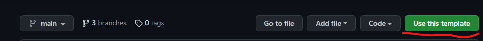
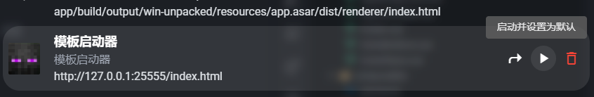

# Швидкий старт

## Налаштування середовища

*Ця стаття написана на основі досвіду використання vscode, рекомендується використовувати vscode для розробки*

Перейдіть до репозиторію github, https://github.com/Voxelum/x-minecraft-launcher-template, натисніть Use this template, щоб створити репозиторій лаунчера



Локально клонуйте щойно створений репозиторій, наприклад, якщо ваш репозиторій називається `my-launcher`

```bash
git clone https://github.com/<username>/my-launcher
```

Перейдіть до папки репозиторію та встановіть його, переконайтеся, що у вас є `nodejs` та `pnpm`.

<details>
  <summary>Як встановити pnpm</summary>
  
  Детальніше дивіться https://www.pnpm.cn/installation
  
  Якщо у вас є node, ви можете встановити так
  ```sh
  npm install -g pnpm
  ```
</details>

```bash
cd my-launcher # перейти до папки
pnpm i # встановити середовище розробки
```

Після завершення встановлення запустіть наступну команду, щоб запустити середовище розробки

```bash
pnpm dev
```

Якщо встановлення пройшло успішно, ви побачите в командному рядку наступне

```
  vite v2.7.13 dev server running at:

  > Local: http://localhost:25555/
  > Network: use `--host` to expose
```

Потім відкрийте XMCL для завантаження вашого середовища розробки,
Знайдіть іконку XMCL в системному треї, клацніть правою кнопкою миші та виберіть `Переглянути інтерфейс стороннього лаунчера`


У верхній панелі введіть адресу з командного рядка та додайте в кінці `index.html`

Наприклад: `http://localhost:25555/index.html`, і натисніть кнопку встановлення


Після встановлення ви побачите напис `Шаблон лаунчера` у списку інтерфейсів, натисніть `Запустити та встановити за замовчуванням`



Потім ви побачите інтерфейс шаблону лаунчера

## Використання сервісів

Основні функції лаунчера інкапсульовані як `Service` (сервіси). Сервіси бувають двох типів: зі станом та без стану.

Більшість сервісів мають стан, наприклад, стан сервісу встановлення зберігає список версій, отриманих при оновленні (як-от Minecraft),
сервіс користувача зберігає стан входу користувача.

Доступ до стану сервісу можна отримати через `service.state`.

### Поширені методи сервісів

| Функція | Сервіс | Пов'язаний метод | Примітка |
|---------|--------|------------------|-----------|
| Запуск гри | LaunchService | launch | За замовчуванням запускає поточний екземпляр |
| Оновити список версій Minecraft | InstallService | refreshMinecraft | Після оновлення потрібно отримати список версій через state (стан) |
| Встановити Minecraft | InstallService | installMinecraft | Потрібно отримати інформацію про версію для встановлення через state як параметр |
| Встановити Forge | InstallService | installForge | |
| Створити екземпляр | InstanceService | createInstance | |
| Вибрати екземпляр | InstanceService | mountInstance | |
| Редагувати екземпляр | InstanceService | editInstance | |
| Оновити список встановлених локальних версій | VersionService | refreshVersions | Результати оновлення зберігаються в state |

### Поширені властивості сервісів

| Функція | Сервіс | Пов'язана властивість | Примітка |
|---------|--------|----------------------|-----------|
| Отримати список версій Minecraft | InstallService | state.minecraft | |
| Список версій Forge для встановлення | InstallService | state.forge | Цей список зберігається за версією Minecraft, наприклад state.forge['1.18.2'] - це список forge для 1.18.2 |
| Отримати шлях поточного вибраного екземпляра | InstanceService | state.path | Використовуйте разом з state.all[path] для отримання конфігурації екземпляра для цього шляху |
| Усі відомі екземпляри | InstanceService | state.instances | |
| Отримати список встановлених модів екземпляра | InstanceModService | state.mods | |
| Отримати список **всіх** встановлених модів | ResourceService | state.mods | |
| Отримати список всіх встановлених локальних версій | VersionService | state.local | |

## Сценарії

Q: Я виконав всі кроки вище і тепер готовий налаштувати власний лаунчер для мого сервера. Зараз мені потрібні базові функції, включаючи, але не обмежуючись "оновленням версій minecraft і forge, синхронізацією модів та конфігураційних файлів з сервером, офіційним або офлайн входом". Як це реалізувати в коді?

A:
Перш ніж відповісти на це питання, вам потрібно розуміти механізм екземплярів (instance) XMCL, це не складно, деталі дивіться в [цій документації](https://xmcl.app/zh/faq))

Щоб уникнути конфліктів між конфігурацією нашого сервера та іншими конфігураціями запуску, нам потрібно спочатку отримати унікальний екземпляр

```ts
// Отримати директорію екземпляра запуску
instancePath.value = await instanceService.acquireInstanceById('piggy-server')
await instanceService.mountInstance(instancePath.value)
```

Де `piggy-server` - це унікальний ID конфігурації запуску, який ви обираєте, а `mountInstance` забезпечує, що всі подальші операції застосовуватимуться до вашої конфігурації.

### Ваша конфігурація запуску

Якщо вашому серверу потрібен Minecraft 1.18.2, Forge 40.0.44 та набір модів.
Оскільки наш шаблон використовує vue, тут наведемо приклад реалізації vue, спочатку вам потрібно оголосити їх в коді

```ts
const expectMc = ref('1.18.2') // версія mc
const expectForge = ref('40.0.44') // версія forge
const modsLists = ref([
  {
    // шлях до мода
    path: "mods/Architectury-4.1.39.09fa85.jar",
    // URL завантаження мода
    url: "https://raw.staticdn.net/dozono/PigServerMods/master/mods/Architectury-4.1.39.09fa85.jar",
    // sha1 мода
    hash: "09fa853c5eef54b3df2cfafe4d3f76a2101e5b2e"
  }
  //... багато інших модів пропущено
])
```

З цим ви можете використовувати реактивне API vue для обчислення потрібної конфігурації запуску

```ts
// Поточний екземпляр запуску
const targetInstance = computed(() => instanceService.state.all[instancePath.value])
// Очікувана версія запуску
const expectedVersion = computed(() => versionService.state.local.find(v => v.minecraftVersion === expectMc.value && resolveForgeVersion(v) === expectForge.value))
// Очікувана версія mc
const expectedMinecraftVersion = computed(() => versionService.state.local.find(v => v.minecraftVersion === expectMc.value && v.inheritances.length === 1))
// Моди для встановлення
const modsToInstalled = computed(() => {
  const installed = instanceModService.state.mods
  return modsLists.value.filter(m => !installed.find(v => v.hash === m.hash))
})
// Чи потрібно оновлювати екземпляр запуску
const needUpdate = computed(() => !expectedVersion || modsToInstalled.value.length > 0)
```

Потім ви можете встановити Minecraft або Forge залежно від ситуації

```ts
// Якщо немає відповідної версії mc
if (!expectedMinecraftVersion.value) {
  status.status = Status.DownloadMinecraft
  // Встановити minecraft
  const mcVersion = installService.state.minecraft.versions.find(mc => mc.id === expectMc.value)
  await installService.installMinecraft(mcVersion!)
}

// Якщо немає відповідної версії mc + forge
if (!expectedVersion.value) {
  status.status = Status.DownloadForge
  // Встановити forge
  await installService.installForge({
      mcversion: expectMc.value,
      version: expectForge.value,
  })
}
```

Потім вам потрібно переконатися, що моди та інші файли в екземплярі оновлені

```ts
// Якщо є моди для встановлення
if (modsToInstalled.value.length > 0) {
  status.status = Status.DownloadUpdate
  // Оновити файли
  await instanceIOService.applyInstanceUpdate({
      path: targetInstance.value.path,
      updates: [...toRaw(modsToInstalled.value).map(toRaw)], // оскільки об'єкт vue є проксі, потрібен toRaw для передачі в сервіс
  })
}
```

Нарешті, вам потрібно переконатися, що екземпляр вибрав правильну версію

```ts
// Якщо версія цільового екземпляра не дорівнює очікуваній версії
if (targetInstance.value.version !== expectedVersion.value?.id) {
  // Забезпечити запуск правильної версії
  await instanceService.editInstance({
      version: expectedVersion.value?.id
  })
}
```

Тепер ви можете запустити гру

```ts
await launchService.launch({
  launcherName: 'назва вашого лаунчера',
  launcherBranch: 'бренд вашого лаунчера'
})
```

## Низькорівневий інтерфейс сервісів

Весь клієнтський доступ потрібно здійснювати через `serviceChannel` для створення з'єднання з сервісом:

```ts
import { LaunchServiceKey } from '@xmcl/runtime-api'

// Встановити з'єднання
const launchServiceChannel = serviceChannel.open(LaunchServiceKey)
// Використовувати метод service
launchServiceChannel.call('launch') // викликати запуск, ціль - поточний екземпляр
```

Для сервісів зі станом ви можете отримати поточний стан через `sync`

```ts
import { InstallServiceKey } from '@xmcl/runtime-api'

const installServiceChannel = serviceChannel.open(InstallServiceKey)

installServiceChannel.sync().then(payload => {
  // Поточний стан service
  const state = payload.state
})
installServiceChannel.on('commit', ({ mutation, id }) => {
  if (this.store.state[`services/${service}`].syncing) {
    syncingQueue[id] = mutation
    return
  }
  const newId = lastId + 1
  if (id !== newId) {
    console.log(`Конфлікт синхронізації з main. Останній id в renderer: ${lastId}. Синхронізація з main ${id}`)
    sync()
  } else {
    this.store.commit(mutation.type, mutation.payload)
    lastId = newId
  }
})
```

## Моніторинг стану завдань

Лаунчер запускає деякі завдання у фоновому режимі, наприклад, завантаження гри, встановлення forge тощо. Ви можете відстежувати всі завдання через `taskMonitor`.

Спочатку потрібно викликати `subscribe`, щоб отримати стан всіх завдань і почати відстежувати оновлення завдань.

```ts
// Почати відстежувати всі активності завдань
taskMonitor.subscribe().then((tasks) => {
  // tasks - це поточний стан всіх завдань
  // тут ви повинні зберегти tasks і відобразити їх в менеджері завдань

  // тут показана внутрішня структура будь-якого task
  const task = tasks[0]
  task.uuid // це uuid, унікальний для кожного завдання
  task.id // оскільки є підзавдання, цей id використовується для розрізнення підзавдань
  const realDistinctId = task.uuid + '@' + task.id // це використовується для повного розрізнення батьківських і дочірніх завдань
  task.path // анотована назва завдання, наприклад installForge.downloadInstaller, використовується для пошуку відповідної назви, як 'installForge.downloadInstaller' відповідає 'Завантаження встановлювача Forge'
  task.param // параметри завдання, також використовуються для генерації відповідної назви, наприклад, якщо поточне завдання - завантаження Minecraft jar (installVersion), то в param буде 'version', що представляє поточну версію Minecraft для завантаження
  task.time // час останнього оновлення завдання
  task.state // стан завдання, це число, ви можете подивитися визначення в перерахуванні TaskState, 1 означає виконується, 2 означає скасовано
  task.progress //  прогрес завдання
  task.total //  загальна довжина завдання
  const percentage = task.progress / task.total // відсоток виконання завдання - це прогрес, поділений на загальну довжину
  task.children //  масив підзавдань, кожен елемент має таку ж структуру, як і task
})
```

Після виклику `subscribe`, taskMonitor буде повідомляти вас про оновлення стану завдань через події

```ts
taskMonitor.on('task-update', (event) => {
  // Нові додані завдання
  const adds = event.adds
  // Оновлені завдання
  const updates = event.updates
})
```
